# 📦 Project: Build APIs with Node.js and Express.js for Shoppyglobe E-commerce Web-App

A simple RESTful API built with Node.js, Express, and MongoDB using Mongoose to manage user data.

## GitHub Repo Link

```sh
https://github.com/SandyBhai03/BACKEND/tree/main/Assignments/Assignment-2/restful-api-mongo
```

---

## 📚 Features

- ✅ MongoDB Integration using Mongoose

- ✅ Schema validation (email, required fields)

- ✅ Hash password and store in DB

- ✅ Register and Login as Admin or User Using JWT Token Features

- ✅ Admin can Fetch all registerd users

- ✅ Admin can Add new Products in DB

- ✅ Login User can Add, Update, Delete Products in Cart

- ✅ Check Admin or not using Admin middleware

- ✅ Proper error handling and status codes

---

## 🛠️ Technologies Used

- Node.js
- Express.js
- MongoDB (Compass for GUI)
- Mongoose ODM
- Thunder Client (for API testing)

---

## 📁 Folder Structure

```sh
📁 shoppyglobe-backend/
│
├── server.js # Main entry point
├── .env # Environment variables
├── package.json # Project metadata and dependencies
│
├── config/ # Database configuration
│ └── db.js # MongoDB connection setup
│
├── controllers/ # Business logic for each route
│ ├── authController.js # Registration and login logic
│ ├── cartController.js # Cart operations logic
│ └── productController.js # Product operations logic
│
├── middleware/ # Middleware (JWT authentication)
│ ├── isAdmin.js # check Admin Middleware
│ ├── verifyToken.js # Protect routes with JWT verification
│
├── models/ # Mongoose schemas/models
│ ├── Cart.js # Cart schema
│ ├── Product.js # Product schema
│ └── User.js # User schema
│
├── routes/ # Route definitions
│ ├── authRoutes.js # Auth endpoints: /register, /login
│ ├── cartRoutes.js # Cart endpoints: /cart
│ └── productRoutes.js # Product endpoints: /products
```

## 🚀 Installation & Running

1. Clone this repo or download the zip.

```sh
https://github.com/SandyBhai03/BACKEND.git
```

2. Navigate to the project folder:

```sh
cd Assignments/Assignment-2/restful-api-mongo
```

2. Install dependencies

```sh
npm install
```

3. Create a .env file and add your MongoDB URI:

```sh
MONGO_URI=mongodb://127.0.0.1:27017/shoppyglobe
```

4. Start the development server

```sh
node server.js
```

(Or use nodemon index.js if installed globally for auto-reloading)

# 🧪 API Endpoints

### 1.➕ POST /api/auth/register — Register as Admin

- json:

```sh
{
  "username": "Admin1",
  "email": "admin@example.com",
  "password": "adminpass",
  "role": "admin"
}
```

- ✅ Returns 201 Created

### Sample Screenshots

#### i. register as Admin in Thunder Client

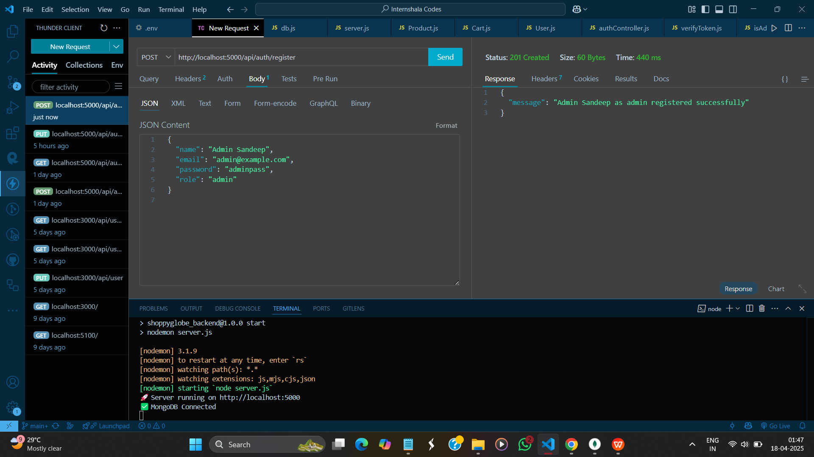

#### ii. register as admin in MongoDB Compass after registered

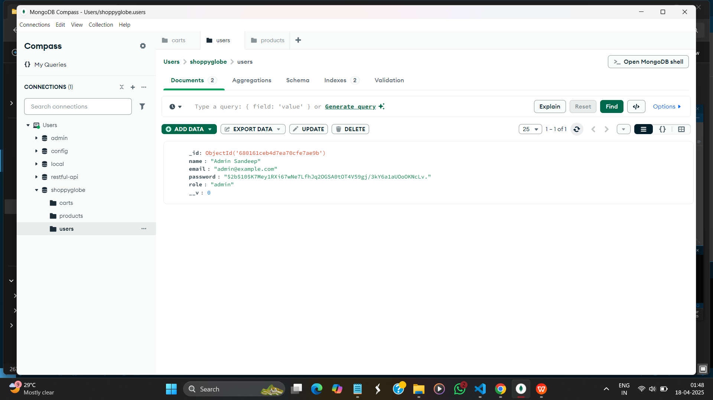

### 2. ➕ POST /api/auth/login — login as Admin

### Sample Screenshots

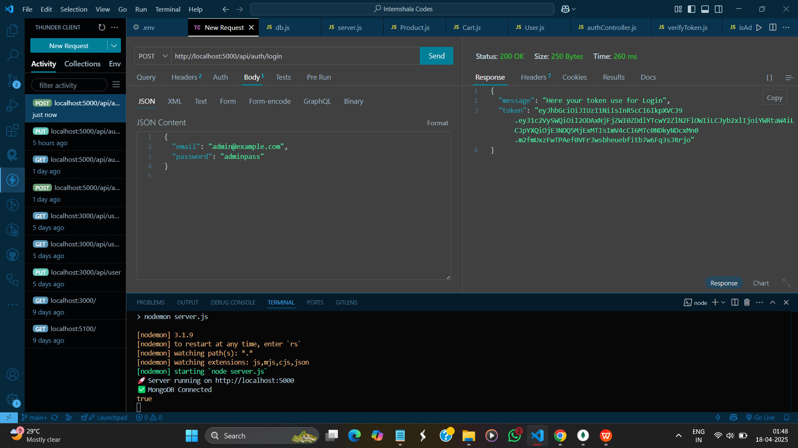

### 3. ➕ POST /api/products

```sh
    {
      "name": "new Product",
      "price": 999,
      "description": "New Product",
      "stock": 5
    }
```
### Sample Screenshots

#### i. admin add products in thunder client
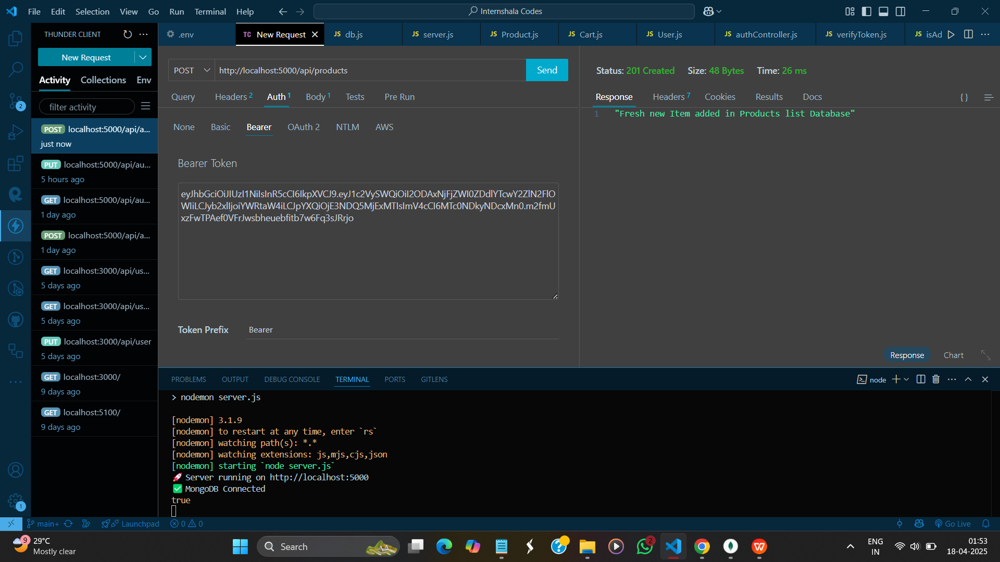

#### ii. admin add products in MongoDB Compass
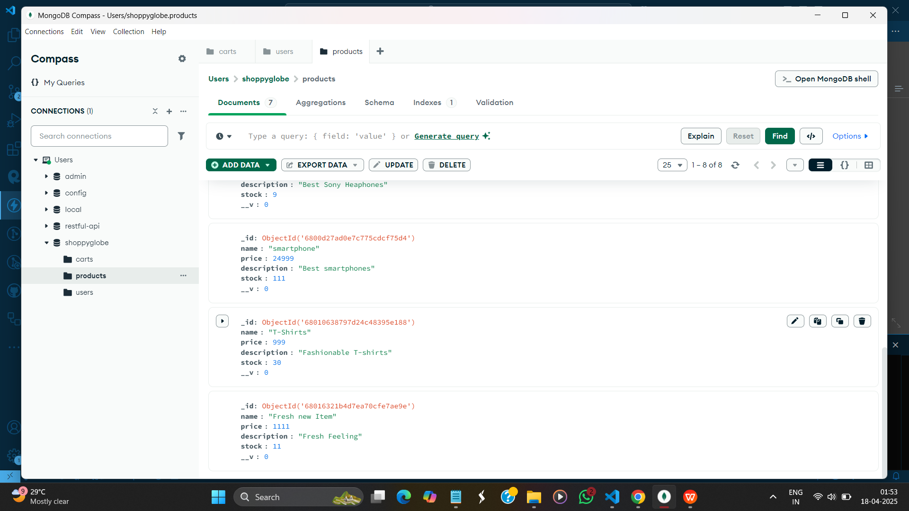

- ✅ Returns 201 if created

- ❌ Returns error

## ✅ GET /api/auth/users — Admin get all registered users

### Sample Screenshots

#### i. Admin get all users thunder client
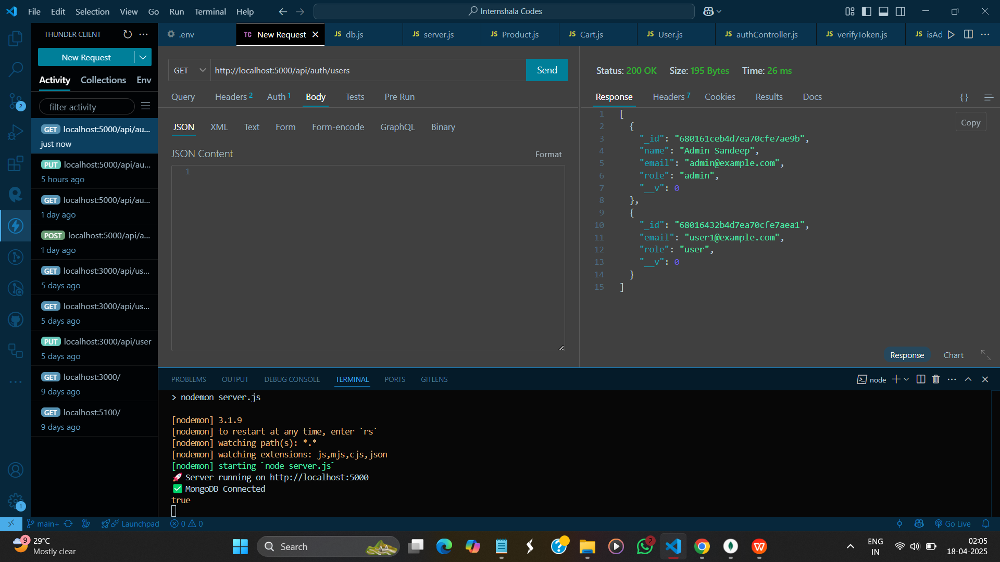

#### ii. Admin get all users MondoDB Compass
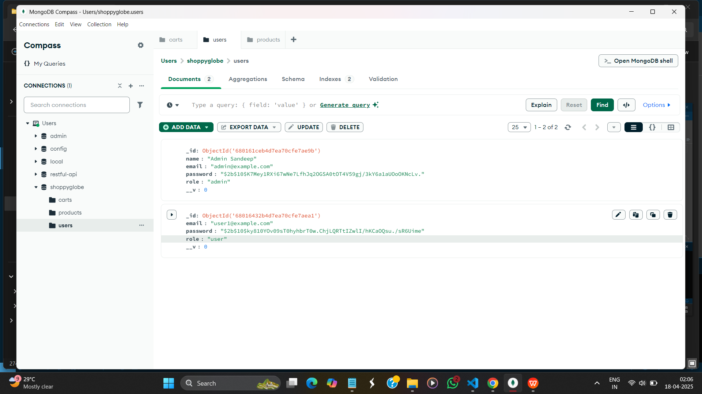

#### ~~~~~~~~~~~~~ User Tasks ~~~~~~~~~~~~~~

### 1.➕ POST /api/auth/register — Register as User

- json:

```sh
{
  "username": "Admin1",
  "email": "admin@example.com",
  "password": "adminpass",
  "role": "user" // take default as user if not give any role value
}
```

#### Sample Screenshots

#### i. register as User in Thunder Client 


#### ii. register as User in MongoDB Compass after registered 

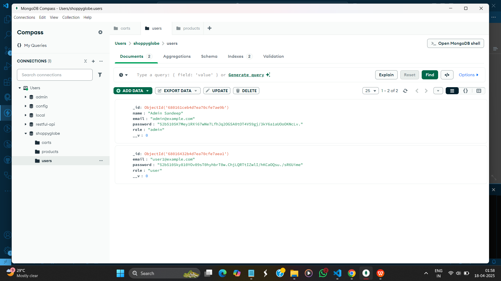

## 2. ➕ POST /api/auth/login — Login as User 

#### i. Login as User Thunder Client

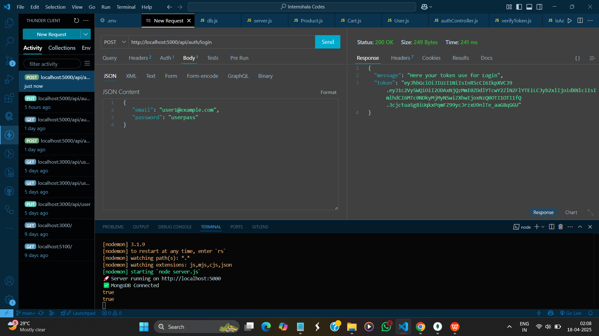

## 3. ✅ GET /api/products — get all products

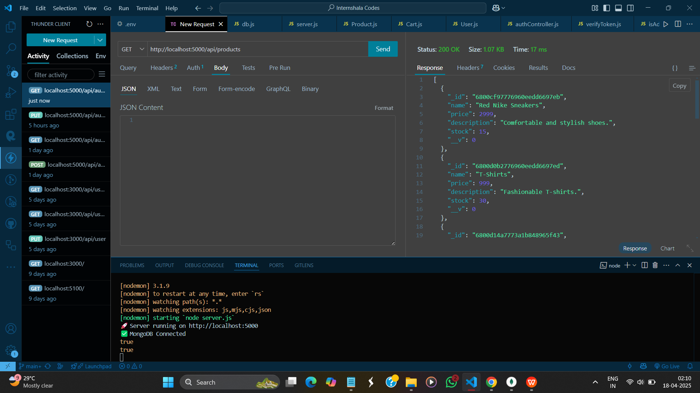

## 4. ✅ GET /api/products/:id — get single product by ID

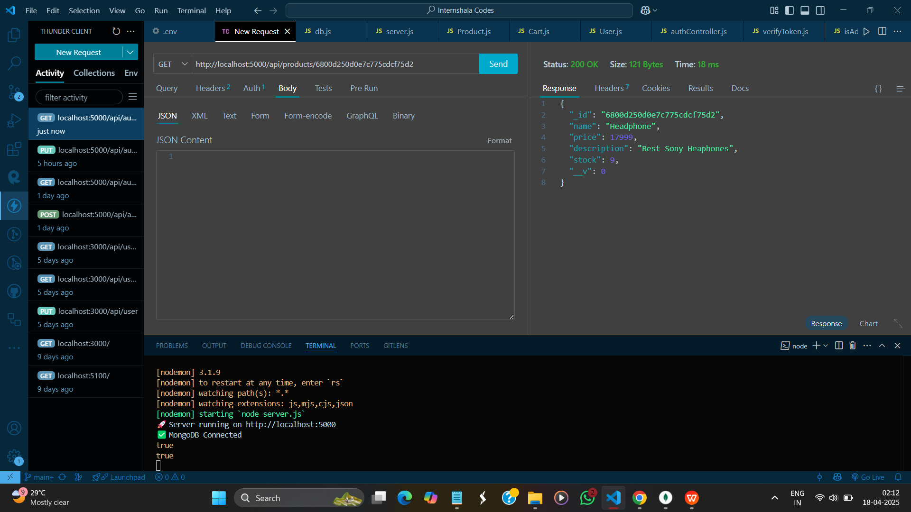

## ~~~~~~~ Only Registered User can access these routes ~~~~~~~~

## 5. ➕ POST /api/cart — add product to cart by productId

#### i. add item to cart thunder client
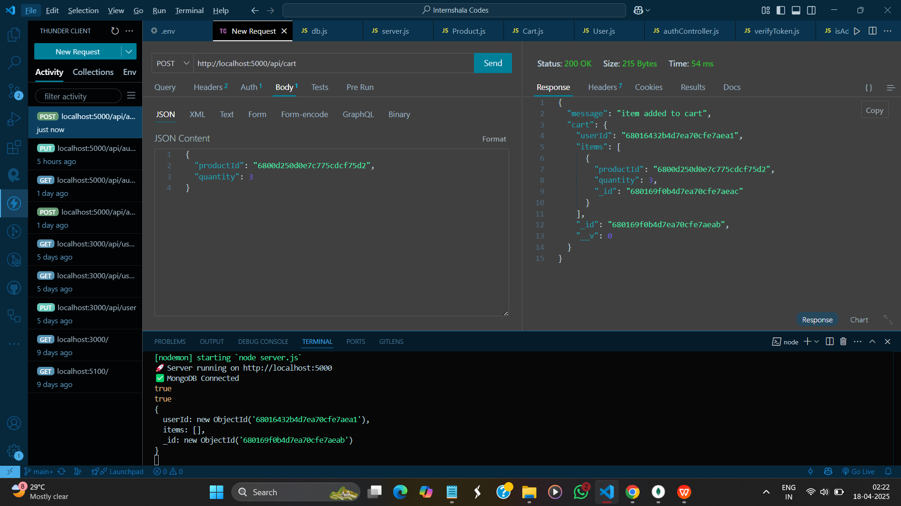

#### ii. add item to cart MongoDB compass


## 6. ✏️ PUT /api/cart — update product quantity to cart by productId

#### i. update item quantity to cart thunder client


#### ii. update item quantity to cart MongoDB compass
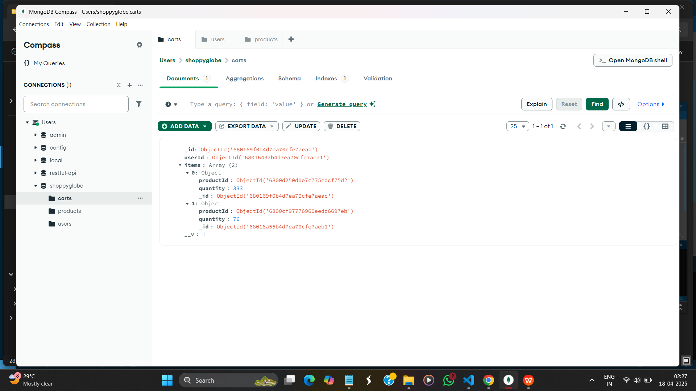

## 7. ❌ DELETE /api/cart — delete product from cart by productId

#### i. delete item from cart thunder client
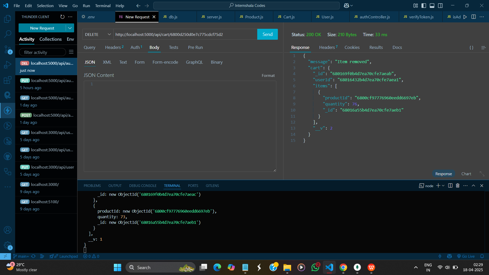

#### ii. delete item from cart MongoDB compass
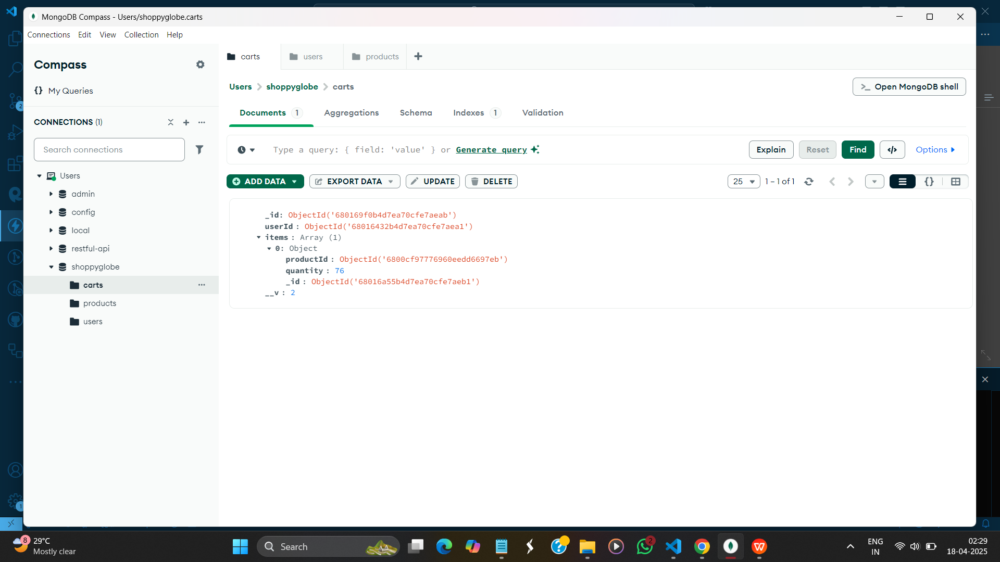

## 🙌 Author

Sandeep Yadav
B.Tech CSE | Internshala Assignment
